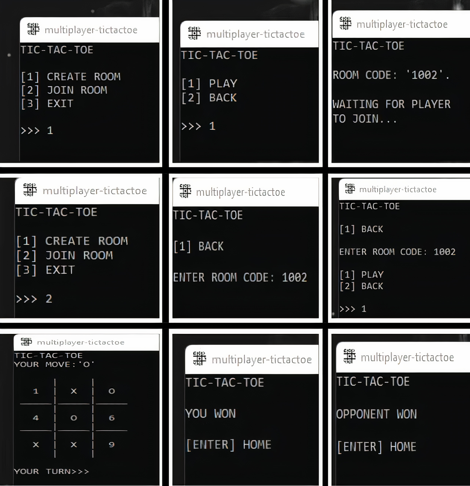

<h1>TicTacToe README</h1>

A quick multiplayer TicTacToe game designed using (Python-MySQL) and can be triggered directly from the command line.

<h2>INSTALLATION</h2>

<ol>
    <li>clone TicTacToe into your desired folder.</li>
    <code>git clone https://github.com/shubhamistic/TicTacToe.git</code>
    <li>To look at the source code (written in Python) open <code>TicTacToe.py</code></li>
    <li>INSTALL mysql.connector module using <code>pip install mysql-connector-python</code> </li>  
    <li>RUN/PLAY the game using <code>python3 TicTacToe.py</code> command.</li>
</ol>

<h2>SETTING UP YOUR PERSONAL MySQL DATABASE</h2>

To setup your personal MySQL database make sure it is accepting remote connection properly.
     
    Now, choose the TicTacToe.py file according to your OS ,

    <ol>
        <li>After choosing the file click open the file or you can use any editor of your choice if on command line.</li>
        <li>Go to line-422 it will look something like - </li>
        <code>database=mycon.connect(host='shubhamistic.com',user='TicTacToe',password='tictactoe@123',database='TicTacToe')</code>
        <li>Enter your host,user,password,database details.</li>
        <li>Do the exact same thing on line-74 , line-134 , line-231.</li>
        <li>Save the code</li>
    </ol>

<h3>ADDING TABLES TO YOUR MYSQL DATABASE</h3>

You have to manually add tables in mysql database. The commands for adding tables in mysql are,

    <ol>
        <li>Creating the roomlist table. Enter the following command in your MySQL shell,</li>
            <code>create table roomlist (roomid char(4) , status varchar(6) , time datetime);</code>
        <li>Now inserting a data in Mysql 'roomlist' table FOR example</li>
            <code>insert into roomlist values('1001','unused','2022-01-31 3:08:00');</code>
        <li>NOTE "Data in column 'status' must be set to 'unused' so that a player can join a room."</li>
        <li>creating the rooms table. Enter the following command in your MySQL shell,</li>
            <code>create table rooms(roomid char(4) , owner char(1) , joiner char(1), joined char(1), turn char(1) , boxvalue1 char(1) , boxvalue2 char(1) , boxvalue3 char(1) , boxvalue4 char(1) , boxvalue5 char(1) , boxvalue6 char(1) , boxvalue7 char(1) , boxvalue8 char(1) , boxvalue9 char(1));</code>
        <li>Now inserting a data in Mysql 'rooms' table FOR example</li>
            <code>insert into rooms values('1001' , 'X' , 'O' , '1' , 'X' , '1' , '2' , '3' , '4' , '5' , '6' , '7' , '8' , '9');</code>
        <li>NOTE "Data in column 'joined' must be set to '1' so that no third player can join your room."</li>
    </ol>
